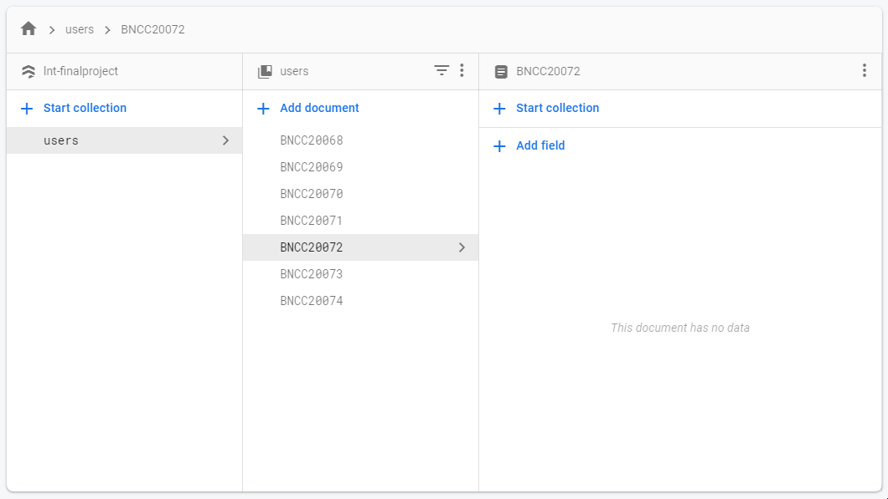
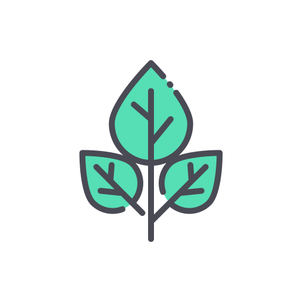

# Menthol Course
A part of LnT Final Project.

## Firestore Model

## License
HTML Version could be found [here](app/src/main/assets/license.html)

There are several components which have license and 
must be mentioned. This page would give you information 
about this app, Terms and Uses, and License used. This 
app is NoLicense so any actions and effects to and from 
this app wouldn't be creator's fault. This app only makes 
for Final Project and would never be used for business purpose. 
Resources and Products which included in this app are mentioned 
below and <b>me</b> as creator is fully respect to the license 
and follows the rules by provider and products' license. Any 
license or not mentioned license which used in this app and 
causing conflict by the law can contact me by the end of this 
page.

[Icons](https://www.flaticon.com/free-icon/menthol_1553039) made by [Good Ware](https://www.flaticon.com/authors/good-ware)

[Icons](https://www.flaticon.com/free-icon/menthol_1553039) made by [Good Ware](https://www.flaticon.com/authors/good-ware) from [FlatIcon](https://www.flaticon.com/)

This app is using free license from FlatIcon and follow the ToS and EULA.

Android Libraries, JetPack, and Firebase are part of Google. All license follow Google ToS.

Please contact me [by email](mailto:animationfar@gmail.com?subject=MidTest Project Report) if you would like to discuss or I do something wrong with the license.